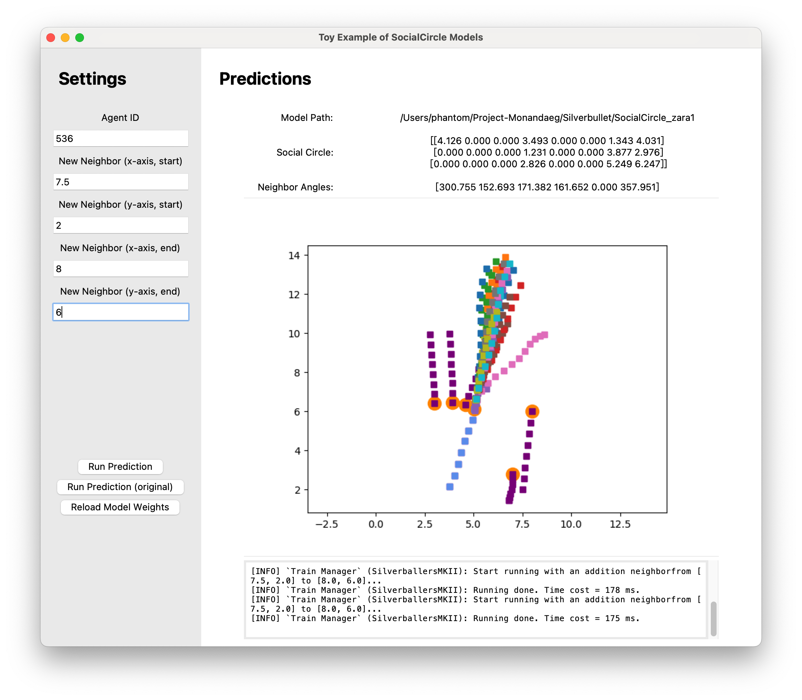

<!--
 * @Author: Conghao Wong
 * @Date: 2023-08-21 15:58:54
 * @LastEditors: Conghao Wong
 * @LastEditTime: 2023-10-25 09:47:43
 * @Description: file content
 * @Github: https://cocoon2wong.github.io
 * Copyright 2023 Conghao Wong, All Rights Reserved.
-->

# SocialCircle

It is the official codes (*PyTorch version*) for "SocialCircle: Learning the Angle-based Social Interaction Representation for Pedestrian Trajectory Prediction".

## Get Started

You can clone [this repository](https://github.com/cocoon2wong/SocialCircle) by the following command:

```bash
git clone https://github.com/cocoon2wong/SocialCircle.git
```

Then, check out this branch:

```bash
git checkout "TorchVersion(beta)"
```

Run the following command to initialize all submodules:

```bash
git submodule update --init --recursive
```

## Requirements

The codes are developed with Python 3.11.
Additional packages used are included in the `requirements.txt` file.

{: .box-warning}
**Warning:** We recommend installing all required Python packages in a virtual environment (like the `conda` environment).
Otherwise, there *COULD* be other problems due to the package version conflicts.

Run the following command to install the required packages in your Python environment:

```bash
pip install -r requirements.txt
```

## Dataset Prepare and Process

Before training `SocialCircle` models on your own dataset, you should add your dataset information.
See [this document](https://cocoon2wong.github.io/Project-Luna/) for details.

## Training

*Available Soon*

## Evaluation

*Available Soon*

### Pre-Trained Model Weights

We have provided our pre-trained model weights to help you quickly evaluate the `SocialCircle` models' performance.
Our pre-trained models contain:

- The basic transformer model for trajectory prediction (named the `Transformer`) and its SocialCircle variation `Transformer-SC` (8 frames' observations to 12 frames' predictions on SDD, only forecasts one deterministic trajectory for each agent);
- `MSN` ([🔗homepage](https://northocean.github.io/MSN/)) and its SocialCircle variation `MSN-SC` (8-to-12 on SDD, forecasts 20 random sampled trajectories for each agent);
- `V^2-Net` ([🔗homepage](https://cocoon2wong.github.io/Vertical/)) and its SocialCircle variation `V^2-Net-SC` (8-to-12 on SDD, 20 trajectories);
- `E-V^2-Net` ([🔗homepage](https://cocoon2wong.github.io/E-Vertical/)) and its SocialCircle variation `E-V^2-Net-SC` (8-to-12 on SDD, 20 trajectories).

You can run the following commands to prepare ETH-UCY and SDD dataset files:

1. Run Python the script inner the `dataset_original` folder:

    ```bash
    cd dataset_original && python main_ethucysdd.py
    ```

2. Back to the repo folder and create soft links:

    ```bash
    cd ..
    ln -s dataset_original/dataset_processed ./
    ln -s dataset_original/dataset_configs ./
    ```

Click the following buttons to download our weights and learn more about how to install these datasets.
We recommend that you download the weights and place them in the `weights/SocialCircle` folder.

<!-- <div style="text-align: center;">
    <a class="btn btn-colorful btn-lg" href="https://github.com/cocoon2wong/SocialCircle/releases">⬇️ Download Weights</a>
    <a class="btn btn-colorful btn-lg" href="https://cocoon2wong.github.io/Project-Luna/howToUse/">💡 Dataset Guidelines</a>
</div> -->

{: .box-warning}
**Warning:** The PyTorch version of codes only support weights that trained with PyTorch.
Currently released weights that trained with TensorFlow can not be used in this branch.
You can go to [this page](https://github.com/cocoon2wong/Project-Monandaeg/tree/main/Silverbullet-Torch) to download the corresponding weights in the new format.

You can start evaluating our pre-trained weights by

```bash
python main.py --sc SOME_MODEL_WEIGHTS
```

Here, `SOME_MODEL_WEIGHTS` is the path of the weights folder, for example, `weights/SocialCircle/evsc_P8_sdd`.

### Toy Example

You can run the following script to learn how the proposed `SocialCircle` works in an interactive way:

```bash
python scripts/socialcircle_toy_example.py
```

Set positions of the manual neighbor to see model's outputs like:

<div style="text-align: center;">
    
</div>

## Args Used

Please specify your customized args when training or testing your model in the following way:

```bash
python main.py --ARG_KEY1 ARG_VALUE2 --ARG_KEY2 ARG_VALUE2 -SHORT_ARG_KEY3 ARG_VALUE3 ...
```

where `ARG_KEY` is the name of args, and `ARG_VALUE` is the corresponding value.
All args and their usages are listed below.

About the `argtype`:

- Args with argtype=`static` can not be changed once after training.
  When testing the model, the program will not parse these args to overwrite the saved values.
- Args with argtype=`dynamic` can be changed anytime.
  The program will try to first parse inputs from the terminal and then try to load from the saved JSON file.
- Args with argtype=`temporary` will not be saved into JSON files.
  The program will parse these args from the terminal at each time.

<!-- DO NOT CHANGE THIS LINE -->
### Basic Args

- `--K_train`: type=`int`, argtype=`static`.
  The number of multiple generations when training. This arg only works for multiple-generation models. 
  The default value is `10`.
- `--K`: type=`int`, argtype=`dynamic`.
  The number of multiple generations when testing. This arg only works for multiple-generation models. 
  The default value is `20`.
- `--anntype`: type=`str`, argtype=`static`.
  Model's predicted annotation type. Can be `'coordinate'` or `'boundingbox'`. 
  The default value is `coordinate`.
- `--batch_size` (short for `-bs`): type=`int`, argtype=`dynamic`.
  Batch size when implementation. 
  The default value is `5000`.
- `--compute_loss`: type=`int`, argtype=`temporary`.
  Controls whether compute losses when testing. 
  The default value is `0`.
- `--dataset`: type=`str`, argtype=`static`.
  Name of the video dataset to train or evaluate. For example, `'ETH-UCY'` or `'SDD'`. NOTE: DO NOT set this argument manually. 
  The default value is `Unavailable`.
- `--draw_results` (short for `-dr`): type=`str`, argtype=`temporary`.
  Controls whether to draw visualized results on video frames. Accept the name of one video clip. The codes will first try to load the video file according to the path saved in the `plist` file (saved in `dataset_configs` folder), and if it loads successfully it will draw the results on that video, otherwise it will draw results on a blank canvas. Note that `test_mode` will be set to `'one'` and `force_split` will be set to `draw_results` if `draw_results != 'null'`. 
  The default value is `null`.
- `--draw_videos`: type=`str`, argtype=`temporary`.
  Controls whether draw visualized results on video frames and save as images. Accept the name of one video clip. The codes will first try to load the video according to the path saved in the `plist` file, and if successful it will draw the visualization on the video, otherwise it will draw on a blank canvas. Note that `test_mode` will be set to `'one'` and `force_split` will be set to `draw_videos` if `draw_videos != 'null'`. 
  The default value is `null`.
- `--epochs`: type=`int`, argtype=`static`.
  Maximum training epochs. 
  The default value is `500`.
- `--experimental`: type=`bool`, argtype=`temporary`.
  NOTE: It is only used for code test. 
  The default value is `False`.
- `--force_anntype`: type=`str`, argtype=`temporary`.
  Assign the prediction type. It is now only used for silverballers models that are trained with annotation type `coordinate` but want to test on datasets with annotation type `boundingbox`. 
  The default value is `null`.
- `--force_clip`: type=`str`, argtype=`temporary`.
  Force test video clip (ignore the train/test split). It only works when `test_mode` has been set to `one`. 
  The default value is `null`.
- `--force_dataset`: type=`str`, argtype=`temporary`.
  Force test dataset (ignore the train/test split). It only works when `test_mode` has been set to `one`. 
  The default value is `null`.
- `--force_split`: type=`str`, argtype=`temporary`.
  Force test dataset (ignore the train/test split). It only works when `test_mode` has been set to `one`. 
  The default value is `null`.
- `--gpu`: type=`str`, argtype=`temporary`.
  Speed up training or test if you have at least one NVidia GPU. If you have no GPUs or want to run the code on your CPU, please set it to `-1`. NOTE: It only supports training or testing on one GPU. 
  The default value is `0`.
- `--interval`: type=`float`, argtype=`static`.
  Time interval of each sampled trajectory point. 
  The default value is `0.4`.
- `--load` (short for `-l`): type=`str`, argtype=`temporary`.
  Folder to load model (to test). If set to `null`, the training manager will start training new models according to other given args. 
  The default value is `null`.
- `--log_dir`: type=`str`, argtype=`static`.
  Folder to save training logs and model weights. Logs will save at `args.save_base_dir/current_model`. DO NOT change this arg manually. (You can still change the path by passing the `save_base_dir` arg.) 
  The default value is `Unavailable`.
- `--lr` (short for `-lr`): type=`float`, argtype=`static`.
  Learning rate. 
  The default value is `0.001`.
- `--macos`: type=`int`, argtype=`temporary`.
  (Experimental) Choose whether enable the `MPS (Metal Performance Shaders)` on Apple platforms (instead of running on CPUs). 
  The default value is `0`.
- `--max_agents`: type=`int`, argtype=`static`.
  Max number of agents to predict in one frame. It only works when `model_type == 'frame-based'`. 
  The default value is `50`.
- `--model_name`: type=`str`, argtype=`static`.
  Customized model name. 
  The default value is `model`.
- `--model_type`: type=`str`, argtype=`static`.
  Model type, canbe `'agent-based'` or `'frame-based'`. 
  The default value is `agent-based`.
- `--model`: type=`str`, argtype=`static`.
  The model type used to train or test. 
  The default value is `none`.
- `--obs_frames` (short for `-obs`): type=`int`, argtype=`static`.
  Observation frames for prediction. 
  The default value is `8`.
- `--only_process_trajectory`: type=`int`, argtype=`static`.
  (Pre/post-process Arg) Controls whether to process non-trajectory model inputs or not. 
  The default value is `0`.
- `--pmove`: type=`int`, argtype=`static`.
  (Pre/post-process Arg) Index of the reference point when moving trajectories. 
  The default value is `-1`.
- `--pred_frames` (short for `-pred`): type=`int`, argtype=`static`.
  Prediction frames. 
  The default value is `12`.
- `--restore_args`: type=`str`, argtype=`temporary`.
  Path to restore the reference args before training. It will not restore any args if `args.restore_args == 'null'`. 
  The default value is `null`.
- `--restore`: type=`str`, argtype=`temporary`.
  Path to restore the pre-trained weights before training. It will not restore any weights if `args.restore == 'null'`. 
  The default value is `null`.
- `--save_base_dir`: type=`str`, argtype=`static`.
  Base folder to save all running logs. 
  The default value is `./logs`.
- `--split` (short for `-s`): type=`str`, argtype=`static`.
  The dataset split that used to train and evaluate. 
  The default value is `zara1`.
- `--start_test_percent`: type=`float`, argtype=`static`.
  Set when (at which epoch) to start validation during training. The range of this arg should be `0 <= x <= 1`. Validation may start at epoch `args.epochs * args.start_test_percent`. 
  The default value is `0.0`.
- `--step`: type=`float`, argtype=`dynamic`.
  Frame interval for sampling training data. 
  The default value is `1.0`.
- `--test_mode`: type=`str`, argtype=`temporary`.
  Test settings. It can be `'one'`, `'all'`, or `'mix'`. When setting it to `one`, it will test the model on the `args.force_split` only; When setting it to `all`, it will test on each of the test datasets in `args.split`; When setting it to `mix`, it will test on all test datasets in `args.split` together. 
  The default value is `mix`.
- `--test_step`: type=`int`, argtype=`static`.
  Epoch interval to run validation during training. 
  The default value is `1`.
- `--update_saved_args`: type=`int`, argtype=`temporary`.
  Choose whether to update (overwrite) the saved arg files or not. 
  The default value is `0`.
- `--verbose` (short for `-v`): type=`int`, argtype=`temporary`.
  Controls if print verbose logs and outputs to the terminal. 
  The default value is `0`.

### First-stage Silverballers Args

- `--Kc`: type=`int`, argtype=`static`.
  The number of style channels in `Agent` model. 
  The default value is `20`.
- `--T` (short for `-T`): type=`str`, argtype=`static`.
  Type of transformations used when encoding or decoding trajectories. It could be: - `none`: no transformations - `fft`: fast Fourier transform - `fft2d`: 2D fast Fourier transform - `haar`: haar wavelet transform - `db2`: DB2 wavelet transform 
  The default value is `fft`.
- `--depth`: type=`int`, argtype=`static`.
  Depth of the random noise vector. 
  The default value is `16`.
- `--deterministic`: type=`int`, argtype=`static`.
  Controls if predict trajectories in the deterministic way. 
  The default value is `0`.
- `--feature_dim`: type=`int`, argtype=`static`.
  Feature dimensions that are used in most layers. 
  The default value is `128`.
- `--key_points`: type=`str`, argtype=`static`.
  A list of key time steps to be predicted in the agent model. For example, `'0_6_11'`. 
  The default value is `0_6_11`.
- `--loss`: type=`str`, argtype=`dynamic`.
  Loss used to train agent models. Canbe `'avgkey'` or `'keyl2'` (default). 
  The default value is `keyl2`.
- `--preprocess`: type=`str`, argtype=`static`.
  Controls whether to run any pre-process before the model inference. It accepts a 3-bit-like string value (like `'111'`): - The first bit: `MOVE` trajectories to (0, 0); - The second bit: re-`SCALE` trajectories; - The third bit: `ROTATE` trajectories. 
  The default value is `100`.

### Second-stage Silverballers Args

- `--Kc`: type=`int`, argtype=`static`.
  The number of style channels in `Agent` model. 
  The default value is `20`.
- `--T` (short for `-T`): type=`str`, argtype=`static`.
  Type of transformations used when encoding or decoding trajectories. It could be: - `none`: no transformations - `fft`: fast Fourier transform - `fft2d`: 2D fast Fourier transform - `haar`: haar wavelet transform - `db2`: DB2 wavelet transform 
  The default value is `fft`.
- `--feature_dim`: type=`int`, argtype=`static`.
  Feature dimensions that are used in most layers. 
  The default value is `128`.
- `--key_points`: type=`str`, argtype=`static`.
  A list of key time steps to be predicted in the agent model. For example, `'0_6_11'`. 
  The default value is `0_6_11`.
- `--points`: type=`int`, argtype=`static`.
  The number of keypoints accepted in the handler model. 
  The default value is `1`.
- `--preprocess`: type=`str`, argtype=`static`.
  Controls whether to run any pre-process before the model inference. It accepts a 3-bit-like string value (like `'111'`): - The first bit: `MOVE` trajectories to (0, 0); - The second bit: re-`SCALE` trajectories; - The third bit: `ROTATE` trajectories. 
  The default value is `100`.

### Silverballers Args

- `--channel` (short for `-c`): type=`int`, argtype=`temporary`.
  Specify the k-th channel of the model output. If `channel == -1`, it outputs all channels' predictions. 
  The default value is `-1`.
- `--down_sampling_rate`: type=`float`, argtype=`temporary`.
  Down sampling rate to sample trajectories from all N = K*Kc trajectories. 
  The default value is `1.0`.
- `--loada` (short for `-la`): type=`str`, argtype=`temporary`.
  Path to load the first-stage agent model. 
  The default value is `null`.
- `--loadb` (short for `-lb`): type=`str`, argtype=`temporary`.
  Path to load the second-stage handler model. 
  The default value is `null`.
- `--pick_trajectories` (short for `-p`): type=`float`, argtype=`temporary`.
  Calculates the sum of the context map values of the predicted trajectories and picks the top n (percentage) best predictions. This parameter is only valid when the model's input contains `MAPS` and `MAP_PARAS`. 
  The default value is `1.0`.

### SocialCircle Args

- `--Ts` (short for `-Ts`): type=`str`, argtype=`static`.
  The transformation on SocialCircle. It could be: - `none`: no transformations - `fft`: fast Fourier transform - `haar`: haar wavelet transform - `db2`: DB2 wavelet transform 
  The default value is `none`.
- `--partitions`: type=`int`, argtype=`static`.
  Partitions in the SocialCircle. It should be manually set at each training run. 
  The default value is `-1`.
- `--rel_speed`: type=`int`, argtype=`static`.
  Choose whether to use the relative speed or the absolute speed as the speed factor in the SocialCircle. (Default to the `absolute speed`) 
  The default value is `0`.
- `--use_direction`: type=`int`, argtype=`static`.
  Choose whether to use the direction factor in the SocialCircle. 
  The default value is `1`.
- `--use_distance`: type=`int`, argtype=`static`.
  Choose whether to use the distance factor in the SocialCircle. 
  The default value is `1`.
- `--use_move_direction`: type=`int`, argtype=`static`.
  Choose whether to use the move direction factor in the SocialCircle. 
  The default value is `0`.
- `--use_velocity`: type=`int`, argtype=`static`.
  Choose whether to use the velocity factor in the SocialCircle. 
  The default value is `1`.

### Visualization Args

- `--draw_distribution`: type=`int`, argtype=`temporary`.
  Controls whether to draw distributions of predictions instead of points. If `draw_distribution == 0`, it will draw results as normal coordinates; If `draw_distribution == 1`, it will draw all results in the distribution way, and points from different time steps will be drawn with different colors. 
  The default value is `0`.
- `--draw_exclude_type`: type=`str`, argtype=`temporary`.
  Draw visualized results of agents except for user-assigned types. If the assigned types are `"Biker_Cart"` and the `draw_results` or `draw_videos` is not `"null"`, it will draw results of all types of agents except "Biker" and "Cart". It supports partial match, and it is case-sensitive. 
  The default value is `null`.
- `--draw_extra_outputs`: type=`int`, argtype=`temporary`.
  Choose whether to draw (put text) extra model outputs on the visualized images. 
  The default value is `0`.
- `--draw_index`: type=`str`, argtype=`temporary`.
  Indexes of test agents to visualize. Numbers are split with `_`. For example, `'123_456_789'`. 
  The default value is `all`.
- `--draw_lines`: type=`int`, argtype=`temporary`.
  Choose whether to draw lines between each two 2D trajectory points. 
  The default value is `0`.
<!-- DO NOT CHANGE THIS LINE -->

## Contact us

Conghao Wong ([@cocoon2wong](https://github.com/cocoon2wong)): conghaowong@icloud.com  
Beihao Xia ([@NorthOcean](https://github.com/NorthOcean)): xbh_hust@hust.edu.cn
