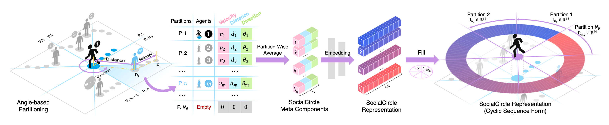

<!--
 * @Author: Conghao Wong
 * @Date: 2023-03-21 17:52:21
 * @LastEditors: Conghao Wong
 * @LastEditTime: 2024-03-26 17:16:21
 * @Description: file content
 * @Github: https://cocoon2wong.github.io
 * Copyright 2023 Conghao Wong, All Rights Reserved.
-->

## Information

This is the homepage of our paper "SocialCircle: Learning the Angle-based Social Interaction Representation for Pedestrian Trajectory Prediction" (CVPR2024).
The paper is available on arXiv.
Click the buttons below for more information.

<div style="text-align: center;">
    <a class="btn btn-colorful btn-lg" href="https://arxiv.org/abs/2310.05370">📖 Paper</a>
    <a class="btn btn-colorful btn-lg" href="https://github.com/cocoon2wong/SocialCircle/blob/page/subassets/img/main.pdf">📖 Supplemental Materials</a>
    <br><br>
    <a class="btn btn-colorful btn-lg" href="https://github.com/cocoon2wong/SocialCircle">🛠️ Codes (TensorFlow 2)</a>
    <a class="btn btn-colorful btn-lg" href="https://github.com/cocoon2wong/SocialCircle/tree/TorchVersion(beta)">🛠️ Codes (PyTorch)</a>
    <a class="btn btn-colorful btn-lg" href="./guidelines">💡 Codes Guidelines</a>
</div>

## Abstract



Analyzing and forecasting trajectories of agents like pedestrians and cars in complex scenes has become more and more significant in many intelligent systems and applications. The diversity and uncertainty in socially interactive behaviors among a rich variety of agents make this task more challenging than other deterministic computer vision tasks. Researchers have made a lot of efforts to quantify the effects of these interactions on future trajectories through different mathematical models and network structures, but this problem has not been well solved. Inspired by marine animals that localize the positions of their companions underwater through echoes, we build a new anglebased trainable social interaction representation, named SocialCircle, for continuously reflecting the context of social interactions at different angular orientations relative to the target agent. We validate the effect of the proposed SocialCircle by training it along with several newly released trajectory prediction models, and experiments show that the SocialCircle not only quantitatively improves the prediction performance, but also qualitatively helps better simulate social interactions when forecasting pedestrian trajectories in a way that is consistent with human intuitions.

## Citation

If you find this work useful, it would be grateful to cite our paper!

```bib
@article{wong2023socialcircle,
  title={SocialCircle: Learning the Angle-based Social Interaction Representation for Pedestrian Trajectory Prediction},
  author={Wong, Conghao and Xia, Beihao and Zou, Ziqian and Wang, Yulong and You, Xinge},
  journal={arXiv preprint arXiv:2310.05370},
  year={2023}
}
```

## Contact us

Conghao Wong ([@cocoon2wong](https://github.com/cocoon2wong)): conghaowong@icloud.com  
Beihao Xia ([@NorthOcean](https://github.com/NorthOcean)): xbh_hust@hust.edu.cn  
Ziqian Zou ([LivepoolQ](https://github.com/LivepoolQ)): ziqianzoulive@icloud.com
